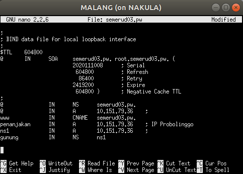
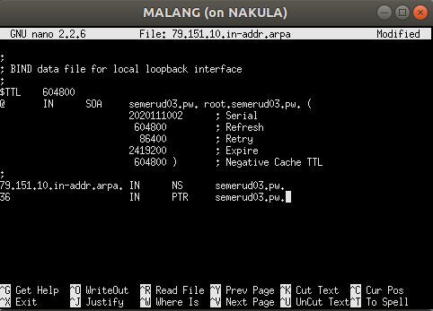
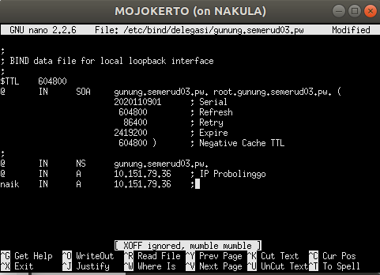
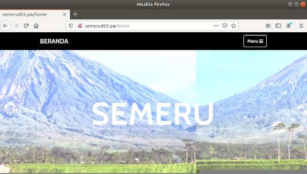
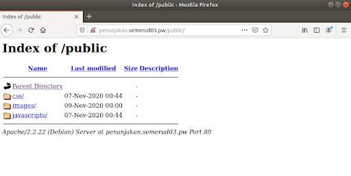
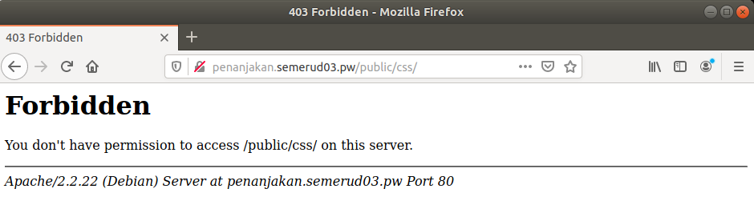
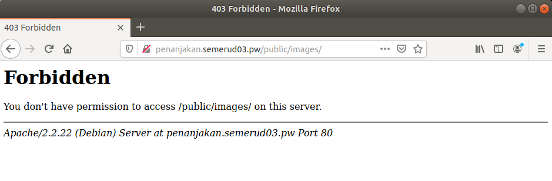
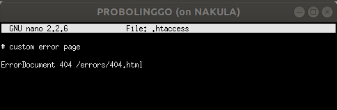
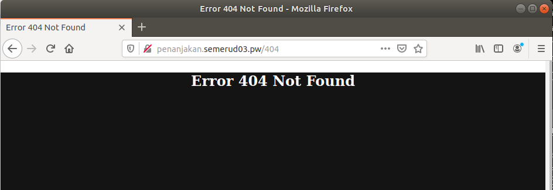
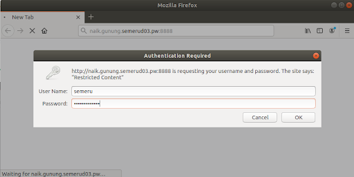

# Modul 2

* <a href="#persiapan">Persiapan</a>
* <a href="#soal-1-3">Soal 1-3</a>
* <a href="#soal-4">Soal 4</a>
* <a href="#soal-5">Soal 5</a>
* <a href="#soal-6-7">Soal 6-7</a>
* <a href="#soal-8-9">Soal 8-9</a>
* <a href="#soal-10-13">Soal 10-13</a>
* <a href="#soal-14-15">Soal 14-15</a>
* <a href="#soal-16">Soal 16</a>
* <a href="#soal-17">Soal 17</a>

## Persiapan
<justify>

<b>(surabaya)</b>

    nano /etc/sysctl.conf
    net.ipv4.ip_forward=1
    sysctl -p

    iptables –t nat –A POSTROUTING –o eth0 –j MASQUERADE –s 192.168.0.0/16
<b>(semua)</b>

setting interface

    nano /etc/network/interfaces

    SURABAYA (Router)

    auto lo
    iface lo inet loopback

    auto eth0
    iface eth0 inet static
    address 10.151.78.18
    netmask 255.255.255.252
    gateway 10.151.78.17

    auto eth1
    iface eth1 inet static
    address 10.151.79.33
    netmask 255.255.255.248

    auto eth2
    iface eth2 inet static
    address 192.168.0.1
    netmask 255.255.255.0

    MALANG (DNS Server Master)

    auto lo
    iface lo inet loopback

    auto eth0
    iface eth0 inet static
    address 10.151.79.34
    netmask 255.255.255.248
    gateway 10.151.79.33

    MOJOKERTO (DNS Server Slave)

    auto lo
    iface lo inet loopback

    auto eth0
    iface eth0 inet static
    address 10.151.79.35
    netmask 255.255.255.248
    gateway 10.151.79.33

    PROBOLINGGO (Web Server)

    auto lo
    iface lo inet loopback

    auto eth0
    iface eth0 inet static
    address 10.151.79.36
    netmask 255.255.255.248
    gateway 10.151.79.33

    SIDOARJO (Klien)

    auto lo
    iface lo inet loopback

    auto eth0
    iface eth0 inet static
    address 192.168.0.2
    netmask 255.255.255.0
    gateway 192.168.0.1

    GRESIK (Klien)

    auto lo
    iface lo inet loopback

    auto eth0
    iface eth0 inet static
    address 192.168.0.3
    netmask 255.255.255.0
    gateway 192.168.0.1

    service networking restart

buat proxy.sh

</justify>

## Soal 1 - 3
<justify>

1. <b>domain</b> http://semerud03.pw​ 

2. <b>alias</b> http://www.semeruyyy.pw​​ 

3. <b>subdomain</b> http://www.penanjakan.semeruyyy.pw ​ yang diatur DNS-nya pada ​ MALANG ​ dan mengarah ke IP Server ​ PROBOLINGGO 

<b>(malang)</b> buat dns, alias, subdomain

    apt-get install bind9 -y
    nano /etc/bind/named.conf.local

    zone "semerud03.pw​" {
		type master;
		file "/etc/bind/jarkom/semerud03.pw";
	};

    mkdir /etc/bind/jarkom
	cp /etc/bind/db.local /etc/bind/jarkom/semerud03.pw
	nano /etc/bind/jarkom/semerud03.pw​
	service bind9 restart

</justify>

## Soal 4
<justify>

4. <b>reverse domain</b> untuk domain utama.

<b>(malang)</b>

    nano /etc/bind/named.conf.local
	10.151.79.36 (IP Probolinggo)

	zone "79.151.10.in-addr.arpa" {
	    type master;
	    file "/etc/bind/jarkom/79.151.10.in-addr.arpa";
	};

	cp /etc/bind/db.local /etc/bind/jarkom/79.151.10.in-addr.arpa
	nano /etc/bind/jarkom/79.151.10.in-addr.arpa

Testing di Sidoarjo dan Gresik

    nano /etc/resolv.conf

    nameserver 10.151.79.34

    host -t PTR 10.151.79.36
</justify>

## Soal 5
<justify>

5. buat <b>DNS Server Slave</b> pada ​MOJOKERTO.

<b>(malang)</b>

    nano /etc/bind/named.conf.local

    zone "semerud03.pw​" {
	    type master;
	    notify yes;
	    also-notify { 10.151.79.35; }; 
	    allow-transfer { 10.151.79.35; }; 
	    file "/etc/bind/jarkom/semerud03.pw";
	};

<b>(mojokerto)</b>

    nano /etc/bind/named.conf.local

    zone "semerud03.pw" {
	    type slave;
	    masters { 10.151.79.34; }; 
	    file "/var/lib/bind/semerud03.pw";
	};

Testing di Sidoarjo dan Gresik

    nano /etc/resolv.conf

    nameserver 10.151.79.35

<b>(malang)</b>

    service bind9 stop
<b>(sidoarjo dan gresik)</b>

    ping semerud03.pw
</justify>

## Soal 6-7
<justify>

6. <b>subdomain</b> dengan alamat ​http://gunung.semerud03.pw​ yang didelegasikan pada server MOJOKERTO ​dan mengarah ke IP Server PROBOLINGGO​ .

7. dibuatkan <b>subdomain</b> dengan nama ​ http://naik.gunung.semerud03.pw

<b>(malang)</b>

    nano /etc/bind/jarkom/semerud03.pw​

    ns1         IN      A       10.151.79.36;
    gunung      IN      NS      ns1

    zone "semerud03.pw​" {
	    type master;
	    file "/etc/bind/jarkom/semerud03.pw​";
	    allow-transfer { 10.151.79.35; };
	};

    nano /etc/bind/named.conf.options

	//dnssec-validation auto;
	allow-query{any;};

<b>(mojokerto)</b>

    nano /etc/bind/named.conf.local

    zone "gunung.semerud03.pw​" {
        type master;
        file "/etc/bind/delegasi/gunung.semerud03.pw";
        allow-transfer { any; };
    };

    mkdir /etc/bind/delegasi
	cp /etc/bind/db.local /etc/bind/delegasi/gunung.semerud03.pw
	nano /etc/bind/delegasi/gunung.semerud03.pw

    nano /etc/bind/named.conf.options

	//dnssec-validation auto;
	allow-query{any;};
</justify>

## Soal 8-9
<justify>

8. Domain http://semerud03.pw memiliki <b>DocumentRoot</b> pada ​/var/www/semerud03.pw​.

9. Alamat http://​semerud03.pw​/index.php/home diganti jadi <b>http://semerud03.pw​/home​</b>.

<b>(probolinggo)</b>

    cd /var/www
	unzip semeru.pw.zip
	mv semeru.pw semerud03.pw

    cd /etc/apache2/sites-available
	cp default semerud03.pw
	nano semerud03.pw

    ServerName semerud03.pw
	ServerAlias www.semerud03.pw

    DocumentRoot ​/var/www/semerud03.pw​

	 <Directory /var/www/semerud03.pw​>
	     Options +FollowSymLinks -Multiviews
	     AllowOverride All
	 </Directory>

Keterangan :

- <code>+FollowSymLinks</code> : agar dapat mengaktifkan mod_rewrite

- <code>-Multiviews</code> : agar mod_negotiation tidak dapat berjalan

- ganti <code>AllowOverride None</code> jadi <code>AllowOverride All</code> agar bisa mengaktifkan .htaccess

    a2ensite semerud03.pw
	a2enmod rewrite
	service apache2 restart

    nano /var/www/semerud03.pw/.htaccess

    RewriteEngine On
 	RewriteCond %{REQUEST_FILENAME} !-d
	RewriteCond %{REQUEST_FILENAME} !-f
	RewriteRule ^home$ /index.php/$1 [L]
	RewriteRule ^aboutus$ /index.php/$1 [L]

</justify>

## Soal 10 - 13
<justify>

10. Web http://penanjakan.semerud03.pw ​menyimpan assets file yang memiliki <b>DocumentRoot</b> pada ​/var/www/​penanjakan.semerud03.pw dan memiliki struktur folder sebagai berikut:
 

    /var/www/​penanjakan.semerud03.pw
                                    /public/javascripts
                                    /public/css
                                    /public/images
                                    /errors

11. Pada folder ​/public <b>dibolehkan directory listing</b> namun untuk folder yang berada <b>di dalamnya tidak dibolehkan</b>.
 

12. disediakan file ​404.html ​pada folder ​/errors ​untuk <b>mengganti error default 404</b> dari Apache.
 

13. url ​http://​penanjakan.semerud03.pw​/public/javascripts​ pake <b>alias</b> http://​penanjakan.semerud03.pw​/js​.
 
<b>(probolinggo)</b>

    cd /var/www
    unzip penanjakan.semeru.pw.zip
	mv penanjakan.semeru.pw penanjakan.semerud03.pw

    cd /etc/apache2/sites-available
    cp default penanjakan.semerud03.pw
	nano penanjakan.semerud03.pw

    ServerName penanjakan.semerud03.pw
	DocumentRoot ​/var/www/penanjakan.semerud03.pw

	<Directory /var/www/penanjakan.semerud03.pw>
		Options +FollowSymLinks -Multiviews
	     	AllowOverride All
	</Directory>

	<Directory /var/www/penanjakan.semerud03.pw/public>
		Options +Indexes
	</Directory>

	<Directory /var/www/penanjakan.semerud03.pw/public/*>
		Options -Indexes
	</Directory>

	Alias "/js" "/var/www/penanjakan.semerud03.pw/public/javascripts"

    a2ensite penanjakan.semerud03.pw
    service apache2 restart

 

</justify>

## Soal 14 - 15
<justify>

14. web ​ http://​naik.gunung.semerud03.pw bisa diakses hanya dengan menggunakan <b>port 8888</b> dan <b>DocumentRoot</b> /var/www/​ naik.gunung.semerud03.pw.

15. web ​ http://​naik.gunung.semerud03.pw agar diberi <b>autentikasi</b> password dengan username <b>​semeru</b> dan password <b>kuynaikgunung</b>.

<b>(probolinggo)</b>

    cd /var/www
	unzip naik.gunung.semeru.pw.zip
	mv semeru naik.gunung.semerud03.pw

    htpasswd -c /etc/apache2/.htpasswd semeru

Keterangan :

- <code>htpasswd</code> : untuk membuat auth basic

- <code>-c</code> : membuat file baru

- <code>semeru</code> : nama user

- kemudian masukan password

    nano /etc/apache2/ports.conf
    Listen 8888

    cd /etc/apache2/sites-available
    cp default naik.gunung.semerud03.pw
	nano naik.gunung.semerud03.pw

    ServerName naik.gunung.semerud03.pw
	DocumentRoot ​/var/www/naik.gunung.semerud03.pw

	<Directory "/var/www/naik.gunung.semerud03.pw">
		AuthType Basic
		AuthName "Restricted Content"
		AuthUserFile /etc/apache2/.htpasswd
		Require valid-user
	</Directory>

    a2ensite naik.gunung.semerud03.pw

</justify>

## Soal 16
<justify>

16. saat mengunjungi ​IP PROBOLINGGO ​akan <b>dialihkan</b> secara otomatis ke ​ http://​semerud03.pw.

<b>(probolinggo)</b>

    nano /etc/apache2/sites-available/default

    Redirect / http://​semerud03.pw
</justify>

## Soal 17
<justify>

17. pengunjung pada /var/www/​penanjakan.semerud03.pw/public/images​ sangat banyak maka semua request gambar yang memiliki substring <b>semeru</b> akan <b>diarahkan</b> menuju semeru.jpg.

<b>(probolinggo)</b>

    nano /var/www/penanjakan.semerud03.pw/.htaccess

    RewriteEngine On
    RewriteRule ^(.*)semeru([^/]+)$ /public/images/semeru.jpg [R=301,L]
</justify>